[<- Back to Main README](../../README.md)

# Live Transcription Feature

This section provides documentation for the live transcription feature implemented in the WhisperPrototype application. This feature allows for real-time audio capture from a microphone, processing via Whisper.net, and continuous display of the transcribed text.

## Feature Documentation

To understand the live transcription feature in detail, please refer to the following documents:

-   **[Implementation Overview](./Details.md):**
    Describes the core architecture, how the feature works, key components like `Workspace.cs` and the `IAudioCaptureService` pattern (including `WslPulseAudioCaptureService.cs`), and the data flow from audio capture to transcribed text.

-   **[Future Enhancements & Roadmap](./Roadmap.md):**
    Outlines potential future improvements and advanced capabilities planned for this feature.

-   **[Troubleshooting WSL Audio](./Troubleshooting.md):**
    Provides guidance for diagnosing and resolving common issues related to microphone input when using this feature within a Windows Subsystem for Linux (WSL) environment, particularly with PulseAudio.

_For the current detailed workings and architecture, please see the [Implementation Overview](./Details.md)._

## High-Level Algorithm

_From `Gemini 2.5 Flash Thinking (High)`_

> Conceptually, how do I process live transcription (using code) i.e. someone speaking into the microphone, and Whisper.net / whisper.cpp processing it. Are there chunks? What's the general algorithm?

Processing live transcription using `whisper.cpp` or `Whisper.net` conceptually involves continuously capturing audio, identifying speech segments, and feeding those segments to the Whisper model. It's an iterative process that relies on intelligent chunking and often Voice Activity Detection (VAD).

Here's a breakdown of the general algorithm:

### Conceptual Algorithm for Live Transcription

1.  **Audio Input Acquisition:**
    *   **Goal:** Continuously capture audio from the microphone.
    *   **Mechanism:** Your application needs to interface with the operating system's audio input devices. This is typically done using audio recording APIs (e.g., WASAPI on Windows, Core Audio on macOS, ALSA/PulseAudio on Linux, or cross-platform libraries like PortAudio or NAudio for .NET).
    *   **Format:** The audio is usually captured as raw PCM samples (e.g., 16-bit, 16kHz mono, which Whisper prefers).

2.  **Audio Buffering:**
    *   **Goal:** Store a rolling window of recent audio data.
    *   **Mechanism:** As audio samples come in, they are added to a buffer (e.g., a circular buffer or a dynamic list). This buffer allows for analysis of recent audio and for "look-back" when extracting speech segments. The size of this buffer depends on your desired VAD look-ahead/look-back and how much audio you want to process at once.

3.  **Voice Activity Detection (VAD):**
    *   **Goal:** Differentiate between periods of speech and periods of silence/noise. This is crucial for efficiency and accuracy. Feeding pure silence to Whisper wastes processing power and can sometimes lead to hallucinations.
    *   **Mechanism:**
        *   **Energy-based VAD (Simpler):** Analyze the amplitude (volume) of the audio. If it's above a certain threshold, it's likely speech. This is prone to noise.
        *   **Machine Learning VAD (More Robust):** Use a pre-trained model (like Silero VAD) that's specifically designed to detect speech based on acoustic features. This is generally preferred for production systems.
    *   **Output:** The VAD constantly monitors the incoming audio buffer and signals when speech starts and ends.

4.  **Speech Segment Extraction:**
    *   **Goal:** When the VAD detects a speech segment (e.g., a speaker starts talking and then pauses), extract that portion of audio.
    *   **Mechanism:**
        *   When VAD signals "speech started," you mark the beginning of the segment.
        *   When VAD signals "speech ended" (or a sufficiently long pause is detected), you extract the audio from the marked start point to the current point from your buffer.
        *   **Crucial:** It's common practice to add a small "padding" or "overlap" (e.g., 200-500ms) to the beginning and end of the extracted segment. This helps Whisper capture full words at the boundaries and provides better context, even if the VAD wasn't perfectly aligned.

5.  **Whisper Processing:**
    *   **Goal:** Send the extracted speech segment to `whisper.cpp`/`Whisper.net` for transcription.
    *   **Mechanism:** The extracted audio chunk (typically a few seconds to perhaps 15-20 seconds long, depending on the speaker's cadence and VAD configuration) is provided to the Whisper model.
    *   `whisper.cpp` is a C++ library, and `Whisper.net` is a C# wrapper around it. They abstract away the model loading and inference, allowing you to pass audio data and receive text.
    *   **Model Size:** The choice of Whisper model size (tiny, base, small, medium, large) impacts transcription quality, speed, and resource usage. For live transcription, smaller models often offer better latency.

6.  **Output Display and Management:**
    *   **Goal:** Display the transcribed text to the user in real-time.
    *   **Mechanism:** As each speech segment is transcribed, its text is appended to a display area.
    *   **Partial Results (Advanced):** Some sophisticated systems might re-transcribe the *latest incomplete segment* periodically to give "interim" results that update as the speaker continues. However, for a basic live system, waiting for a full VAD-detected segment to complete before showing its transcription is common.

7.  **Loop and Cleanup:**
    *   The entire process (Audio Input -> Buffer -> VAD -> Segment Extraction -> Whisper Processing -> Output) repeats continuously until the user stops the recording.
    *   Ensure proper cleanup of audio resources and Whisper model instances when done.

### Are there chunks? Yes, absolutely!

*   **Audio Capture Chunks:** The audio hardware provides samples in small chunks (e.g., every 10-50ms).
*   **VAD Analysis Chunks:** The VAD analyzes these small chunks or a rolling window of audio to detect speech.
*   **Whisper Processing Chunks (Speech Segments):** This is the most significant "chunking." Instead of feeding tiny 100ms pieces to Whisper, you feed larger, *semantically meaningful* chunks (i.e., complete utterances or phrases detected by VAD). These can range from a few seconds to maybe 20-30 seconds of speech.

### Visualizing the Flow

```mermaid
%%{init: {"theme": "dark"}}%%
flowchart TD
    A["Microphone Input
(Raw PCM samples)"]
    B["Audio Buffer
(Circular buffer of recent audio)"]
    C["Voice Activity Detection (VAD)
(Detects speech starts and ends)"]
    D["Speech Segment Extraction
(From buffer, pads audio for context)"]
    E["Whisper.cpp / Whisper.net
(Transcription Model Inference)"]
    F["Display
(Show transcribed text to user)"]

    A --> B
    B --> C
    C -- "Speech Segment Detected!" --> D
    D --> E
    E --> F

    %% Styling for accent colors
    style A fill:#222e3c,stroke:#4fd1c5,stroke-width:2px
    style B fill:#1a365d,stroke:#63b3ed,stroke-width:2px
    style C fill:#2d3748,stroke:#f6ad55,stroke-width:2px
    style D fill:#22543d,stroke:#68d391,stroke-width:2px
    style E fill:#553c9a,stroke:#9f7aea,stroke-width:2px
    style F fill:#744210,stroke:#f6e05e,stroke-width:2px
```

### Key Challenges and Considerations:

*   **Latency:** The total delay from speaking to seeing the text. This is influenced by buffer size, VAD processing time, and critically, the Whisper model's inference time. Smaller Whisper models reduce latency.
*   **Resource Management:** Whisper models can be CPU/GPU intensive. Efficiently managing memory and processing threads is important, especially for continuous operation.
*   **Robustness to Noise:** VAD performance can degrade in noisy environments, leading to false positives (transcribing noise) or false negatives (missing speech).
*   **Whisper Model Limitations:** Whisper is designed for full audio files. Feeding it arbitrary short chunks without proper VAD can lead to poorer quality or "hallucinations."
*   **"Hotword" Detection:** For applications that only need to start transcribing after a specific phrase (like "Hey Google"), you'd add a hotword detection step before engaging the full transcription pipeline.

By following this conceptual algorithm, you can build a robust live transcription system using `whisper.cpp` or `Whisper.net`.